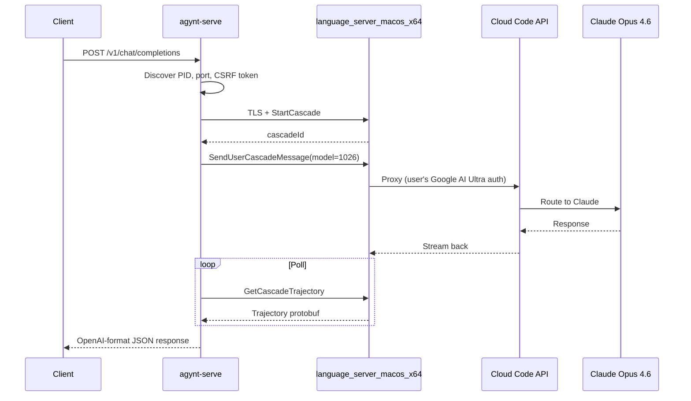

# agynt

Talk to Claude Opus 4.6 from your terminal — no API key needed. Piggybacks on the already-running, already-authenticated Antigravity IDE language server.

```bash
# Interactive TUI
npm run agynt

# One-shot prompt (pipeable)
npm run agynt "What is a burrito? In one sentence."

# OpenAI-compatible API server (for OpenCode, etc.)
npm run serve

# List available models
npm run agynt -- --list-models
```

## API Server

Exposes Claude Opus 4.6 as an OpenAI-compatible API for tools like [OpenCode](https://github.com/opencode-ai/opencode):

```bash
npm run serve
# → http://localhost:4141/v1/chat/completions
```

```bash
# Configure OpenCode
export OPENAI_API_BASE=http://localhost:4141/v1
export OPENAI_API_KEY=agynt

# Or use curl directly
curl http://localhost:4141/v1/chat/completions \
  -H "Content-Type: application/json" \
  -d '{"model":"claude-opus-4.6","messages":[{"role":"user","content":"Hello"}]}'
```

Supports streaming (`"stream": true`), `/v1/models`, and `/health`. Custom port via `PORT=8080 npm run serve`.

## How It Works



## Prerequisites

- **Antigravity IDE** running with at least one workspace open
- **Google AI Ultra** subscription
- **Bun** (for CLI/TUI/server) + **Node.js** ≥ 18 (for building-block scripts)

## Setup

```bash
git clone <repo> && cd agynt
npm install
```

## Scripts

| Command | Description |
|---------|-------------|
| `npm run agynt` | **Interactive TUI** or one-shot (`npm run agynt "prompt"`) |
| `npm run serve` | **OpenAI-compatible API server** on port 4141 |
| `npm run prompt` | Building-block one-shot prompt (tsx) |
| `npm run heartbeat` | Test gRPC connectivity |
| `npm run probe` | Enumerate available gRPC services |

## Architecture

```
cli/                         # End-user tools (Bun)
├── index.ts                 # CLI entry point (Commander)
├── core/cascade.ts          # CascadeSession wrapper
├── oneshot/run.ts            # Pipeable one-shot mode
├── tui/app.tsx              # Ink interactive TUI
└── server/index.ts          # OpenAI-compatible API server

src/                         # Building blocks (tsx/Node)
├── discover.ts              # Server/port/token discovery
├── tls.ts                   # TLS cert extraction
├── client.ts                # Raw gRPC client
├── proto.ts                 # Manual protobuf encoder/decoder
├── prompt.ts                # Original one-shot prompt
├── index.ts                 # Heartbeat test
├── probe.ts                 # Service enumeration
├── auth_probe.ts            # User status & model discovery
├── extract_proto.ts         # Proto schema extraction
└── dump_trajectory.ts       # Trajectory debug tool
```

## Key Technical Details

### Model Enum Values

The proto definitions say `MODEL_CLAUDE_4_OPUS_THINKING = 291`, but the server uses **placeholder slots**. Correct values from `GetUserStatus`:

| Model | Proto Enum | Server Enum |
|-------|-----------|-------------|
| Claude Opus 4.6 (Thinking) | 291 | **1026** |
| Claude Sonnet 4.6 (Thinking) | 282 | **1035** |
| Gemini 3 Flash | — | **1018** |

### Authentication

- **CSRF token** (`x-codeium-csrf-token`) authenticates to the language server
- Language server holds the user's **OAuth access token** from IDE login
- No API key needed — server proxies through Cloud Code with stored credentials

### Cascade Pipeline

Three gRPC calls: `StartCascade` → `SendUserCascadeMessage` → `GetCascadeTrajectory` (poll). Answer at protobuf path `trajectory.steps[].step_result.text`. Model name at `trajectory.cascade_info.planner_config.model_name`.

## License

MIT
