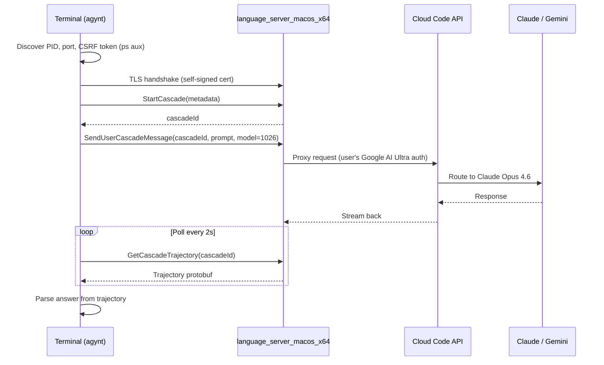

# agynt

Talk to Claude Opus 4.6 from your terminal — no API key needed. Piggybacks on the already-running, already-authenticated Antigravity IDE language server.

```bash
# One-shot prompt
bun run cli/index.ts "What is a burrito? In one sentence."

# Interactive TUI
bun run cli/index.ts

# List available models
bun run cli/index.ts --list-models
```

```
═══ Antigravity One-Shot Prompt ═══

  Prompt: "What is a burrito? In one sentence."
  Server: PID 25741 port 54752

── StartCascade ──
  ✓ cascadeId: edd6f9c9-98f8-460f-98d9-397306145c69

── SendUserCascadeMessage ──
  → Claude Opus 4.6 (Thinking) (1026)...  ✓ Accepted!

── Polling for response ──
  [1] 8734 bytes
  [2] 88784 bytes

═══ Result ═══
  Model requested: Claude Opus 4.6 (Thinking)
  Model used:      claude-opus-4-6-thinking

  Answer: A burrito is a Mexican dish consisting of a flour tortilla
          wrapped around a filling of ingredients such as meat, beans,
          rice, cheese, and salsa.
```

## How It Works



## Prerequisites

- **Antigravity IDE** running with at least one workspace open
- **Google AI Ultra** subscription (provides access to Claude models)
- **Node.js** ≥ 18

## Setup

```bash
git clone <repo> && cd agynt
npm install
```

## Scripts

| Command | What it does |
|---------|-------------|
| `npm run prompt` | Send a one-shot prompt to Claude Opus 4.6 |
| `npm run heartbeat` | Test gRPC connectivity (Heartbeat + HandleAsyncPostMessage) |
| `npm run probe` | Enumerate available gRPC services |

## Architecture

```
src/
├── prompt.ts       # One-shot prompt → Claude Opus 4.6 (Thinking)
├── index.ts        # Heartbeat connectivity test
├── discover.ts     # Auto-discover language server PID, port, CSRF token
├── tls.ts          # Extract self-signed TLS cert from the server
├── client.ts       # Raw gRPC client (no .proto files needed)
├── proto.ts        # Manual protobuf encoder/decoder
├── probe.ts        # Service enumeration tool
├── auth_probe.ts   # User status & model discovery
├── extract_proto.ts # Decode proto schemas from extension.js
└── dump_trajectory.ts # Debug: dump raw trajectory structure
```

## Key Technical Details

### Server Discovery

The script finds `language_server_macos_x64` processes via `ps aux` and extracts:
- **gRPC port** — from `--random_port` (parsed from the actual listening port)
- **CSRF token** — from `--csrf_token <uuid>`
- **Workspace ID** — from `--workspace_id`

### Model Enum Values

The proto definitions (extracted from `extension.js`) define model enums like `MODEL_CLAUDE_4_OPUS_THINKING = 291`, but the server **actually uses placeholder model slots**. The correct values come from calling `GetUserStatus` on the language server:

| Model | Proto Enum | Server Enum |
|-------|-----------|-------------|
| Claude Opus 4.6 (Thinking) | 291 | **1026** |
| Claude Sonnet 4.6 (Thinking) | 282 | **1035** |
| Gemini 3 Flash | — | **1018** |

### Protobuf Without .proto Files

Since the language server's `.proto` definitions aren't published, all protobuf messages are manually encoded/decoded using a minimal encoder in `proto.ts`. Field numbers were discovered by:

1. Extracting base64-encoded `FileDescriptorProto` blobs from `extension.js`
2. Decoding them with `@bufbuild/protobuf`
3. Probing the server with different field layouts

### Cascade Pipeline

The AI request flow uses three gRPC calls:

1. **`StartCascade`** — creates a cascade session, returns a `cascadeId`
2. **`SendUserCascadeMessage`** — sends the prompt with model selection via `CascadeConfig.CascadePlannerConfig.plan_model`
3. **`GetCascadeTrajectory`** — polls for the response; answer text is at protobuf path `trajectory.steps[].step_result.text`

### Authentication

- **CSRF token** (`x-codeium-csrf-token` header) authenticates to the language server
- The language server already holds the user's **OAuth access token** from the IDE login
- No additional API key is needed — the server proxies requests through Cloud Code using the stored credentials

## Available Models

Run `npx tsx src/auth_probe.ts` to see all models available on your server. With Google AI Ultra, typical availability includes:

- Claude Opus 4.6 (Thinking)
- Claude Sonnet 4.6 (Thinking)
- Gemini 3 Flash
- Gemini 3.1 Pro (High/Low)
- GPT-OSS 120B (Medium)

## License

MIT
